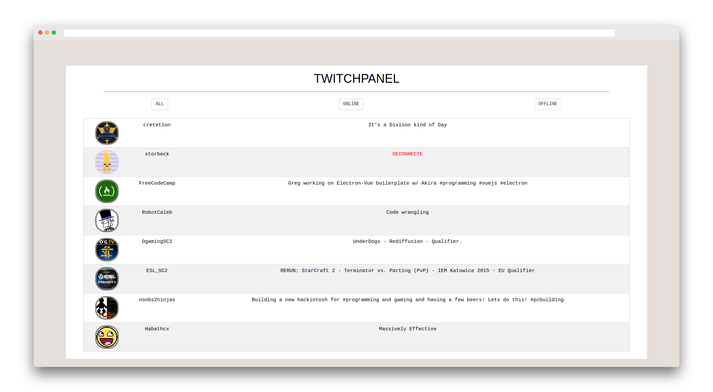

<h1 align="center">
TwitchPanel
</h1>

<p align="center">
    Here is another project I submitted for the front-end libraries <a src="http://freecodecamp.org">FreeCodeCamp</a> course.
    
</p>

---

## Features

* Shows for a certain group of twitch channels which channel has a live stream running or which one is disconnected
* Offers an interface with clickable links to the twitch channels you did select to be in your panel
* Filter between online and offline channels

---

## How does it work ?

The JS file contains an array of names which are the twitch channels which will be displayed on the interface :

```
    var chaines = ["ESL_SC2", "OgamingSC2", "cretetion", "freecodecamp", "storbeck", "habathcx", "RobotCaleb", "noobs2ninjas", "squeezielive"];
```

The code then calls a Twitch API <a href="http://wind-bow.glitch.me/">clone</a> made directly by FreeCodeCamp (in order to be able to use it without any authentication) in order to check for which string what channel will be online or offline.

It also calls the same API to get the profile pictures of each Twitch channel.

---

## Technologies used

* Only ajax